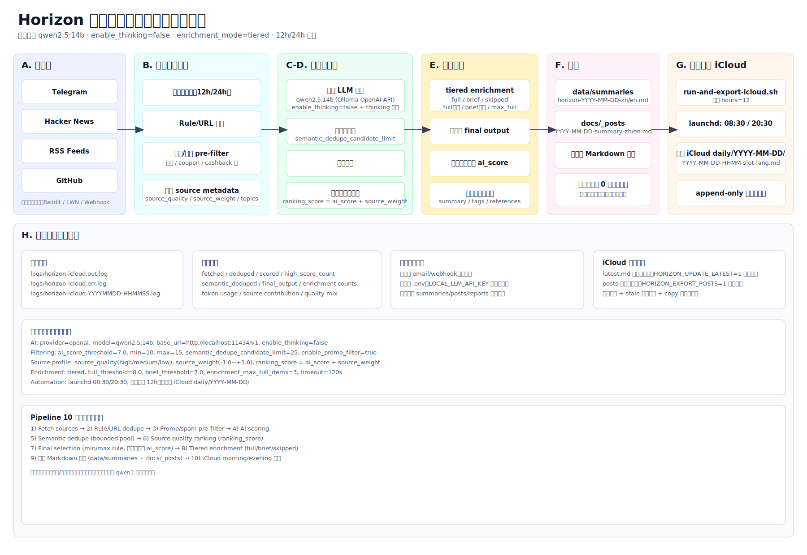
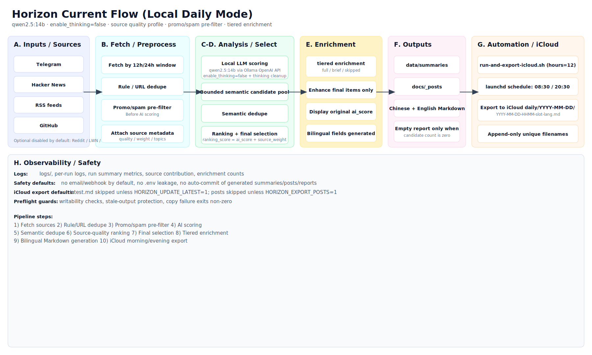

# Horizon Architecture

## 1. Overview

Horizon is a local AI news/tech radar pipeline.  
Current default stack is:

- local model: `qwen2.5:14b` via Ollama OpenAI-compatible API
- `enable_thinking=false`
- `enrichment_mode=tiered`
- source quality profile with `source_weight`
- iCloud morning/evening export automation

## 2. Current Flow Diagram

## 3. Pipeline Steps

1. Fetch sources (Telegram / Hacker News / RSS / GitHub, optional sources disabled by default)
2. Rule/URL dedupe
3. Promo/spam pre-filter
4. AI scoring (local qwen2.5:14b)
5. Semantic dedupe (bounded candidate pool)
6. Source quality ranking (`ranking_score = ai_score + source_weight`)
7. Final selection (min/max output rules; displayed score remains original `ai_score`)
8. Tiered enrichment (`full / brief / skipped`)
9. Bilingual Markdown generation (`data/summaries`, `docs/_posts`)
10. iCloud export (morning/evening slot, append-only daily archive)

## 4. Automation

- launchd schedule: `08:30` and `20:30`
- each run defaults to `--hours 12`
- export target: `daily/YYYY-MM-DD/`
- append-only naming: `YYYY-MM-DD-HHMM-slot-lang.md`

## 5. Safety Notes

- Do not commit `.env`.
- Do not commit generated summaries/posts/reports by default.
- iCloud `latest.md` is skipped by default (`HORIZON_UPDATE_LATEST=1` to enable).
- iCloud posts export is skipped by default (`HORIZON_EXPORT_POSTS=1` to enable).
